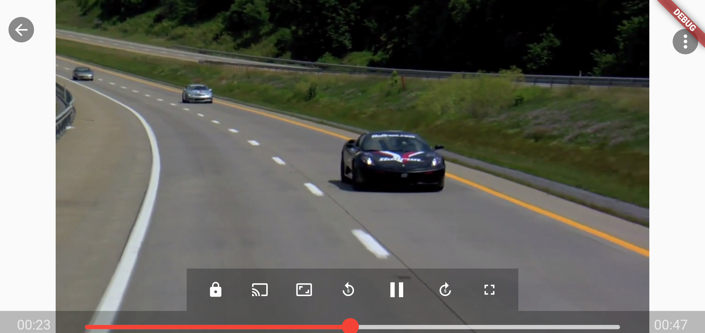

# Smart Player plugin for Flutter

A Flutter plugin for iOS and Android for playing back video on a Widget surface.

|             | Android | iOS  | Web   |
|-------------|---------|------|-------|
| **Support** | SDK 21+ | 11.0+ | Any\* |

[comment]: <> (![The example app running in iOS]&#40;https://github.com/flutter/plugins/blob/main/packages/video_player/video_player/doc/demo_ipod.gif?raw=true&#41;)

## Screenshots




## Installation

First, add `smart_player` as a [dependency in your pubspec.yaml file](https://flutter.dev/using-packages/).

### iOS

If you need to access videos using `http` (rather than `https`) URLs, you will need to add
the appropriate `NSAppTransportSecurity` permissions to your app's _Info.plist_ file, located
in `<project root>/ios/Runner/Info.plist`. See
[Apple's documentation](https://developer.apple.com/documentation/bundleresources/information_property_list/nsapptransportsecurity)
to determine the right combination of entries for your use case and supported iOS versions.

### Android

If you are using network-based videos, ensure that the following permission is present in your
Android Manifest file, located in `<project root>/android/app/src/main/AndroidManifest.xml`:

```xml
<uses-permission android:name="android.permission.INTERNET"/>
```

## Supported Formats

- On iOS, the backing player is [AVPlayer](https://developer.apple.com/documentation/avfoundation/avplayer).
  The supported formats vary depending on the version of iOS, [AVURLAsset](https://developer.apple.com/documentation/avfoundation/avurlasset) class
  has [audiovisualTypes](https://developer.apple.com/documentation/avfoundation/avurlasset/1386800-audiovisualtypes?language=objc) that you can query for supported av formats.
- On Android, the backing player is [ExoPlayer](https://google.github.io/ExoPlayer/),
  please refer [here](https://google.github.io/ExoPlayer/supported-formats.html) for list of supported formats.

## Example

```dart
import 'package:flutter/material.dart';
import 'package:smart_player/video_player_page.dart';

void main() {
  runApp(const MyApp());
}

class MyApp extends StatelessWidget {
  const MyApp({Key? key}) : super(key: key);

  // This widget is the root of your application.
  @override
  Widget build(BuildContext context) {
    return MaterialApp(
      title: 'Smart Player Demo',
      theme: ThemeData(
        primarySwatch: Colors.blue,
      ),
      home: const MyHomePage(title: 'Smart Player'),
    );
  }
}

class MyHomePage extends StatefulWidget {
  const MyHomePage({Key? key, required this.title}) : super(key: key);
  final String title;

  @override
  State<MyHomePage> createState() => _MyHomePageState();
}

class _MyHomePageState extends State<MyHomePage> {

  @override
  Widget build(BuildContext context) {
    return Scaffold(
      appBar: AppBar(
        title: Text(widget.title),
      ),
      body: SizedBox(
        height: 300,
        width: MediaQuery.of(context).size.width,
        child: const SmartPlayer(
          url: "https://commondatastorage.googleapis.com/gtv-videos-bucket/sample/WeAreGoingOnBullrun.mp4",
        ),
      ),
    );
  }
}
```

## Usage

The following section contains usage information that goes beyond what is included in the
documentation in order to give a more elaborate overview of the API.
